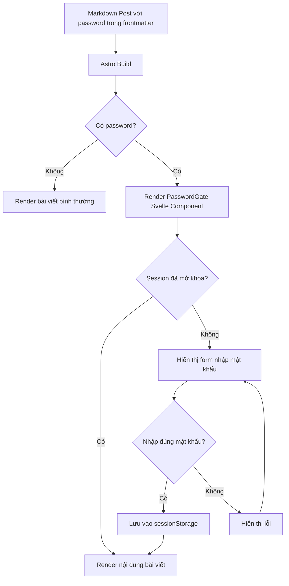
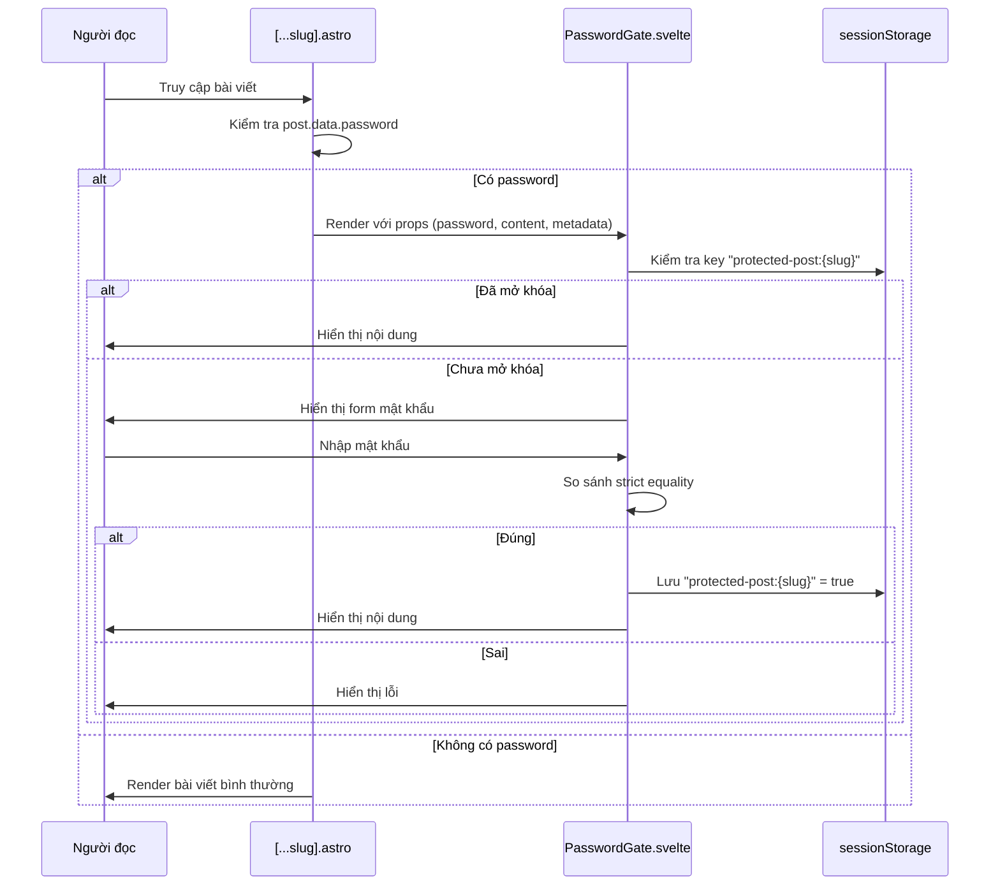

# Tài liệu Thiết kế: Password Protected Posts

## Tổng quan

Tính năng bảo vệ bài viết bằng mật khẩu cho phép chủ blog đặt mật khẩu cho các bài viết cụ thể thông qua trường `password` trong frontmatter. Khi người đọc truy cập bài viết được bảo vệ, một Password Gate (Svelte component) sẽ hiển thị form nhập mật khẩu thay vì nội dung bài viết. Xác thực hoàn toàn ở phía client — không yêu cầu thay đổi backend.

### Quyết định thiết kế chính

1. **Client-side only**: Mật khẩu được lưu trong frontmatter và so sánh trực tiếp ở client. Đây là bảo vệ cơ bản ngăn người đọc thông thường, không phải bảo mật cấp cao.
2. **Conditional rendering trong Svelte**: Nội dung bài viết chỉ được render khi mật khẩu đúng, không có trong DOM trước khi mở khóa.
3. **Session Storage**: Trạng thái mở khóa lưu trong `sessionStorage` — tự động xóa khi đóng tab/trình duyệt.
4. **Svelte 5 runes**: Sử dụng `$state`, `$effect` theo pattern hiện có trong project.

## Kiến trúc



### Luồng dữ liệu



## Components và Interfaces

### 1. Content Schema (Cập nhật)

**File:** `src/content/config.ts`

Thêm trường `password` optional vào blog collection schema:

```typescript
const blogCollection = defineCollection({
  type: 'content',
  schema: z.object({
    title: z.string().min(1, 'Title is required'),
    description: z.string().min(1, 'Description is required'),
    date: z.coerce.date(),
    updatedDate: z.coerce.date().optional(),
    category: z.string().min(1, 'Category is required'),
    tags: z.array(z.string()).default([]),
    coverImage: z.string().optional(),
    draft: z.boolean().default(false),
    slug: z.string().optional(),
    password: z.string().max(128).optional(),
  }),
});
```

### 2. PasswordGate Component (Mới)

**File:** `src/components/PasswordGate.svelte`

```typescript
// Props interface
interface Props {
  password: string;       // Mật khẩu từ frontmatter
  slug: string;           // Slug bài viết cho sessionStorage key
  title: string;          // Tiêu đề bài viết
  date: string;           // Ngày đã format
  category?: string;      // Danh mục (optional display)
  tags?: string[];        // Thẻ (optional display)
}
```

**Trách nhiệm:**
- Kiểm tra `sessionStorage` khi mount để xác định trạng thái mở khóa
- Hiển thị form mật khẩu hoặc nội dung (slot) dựa trên trạng thái
- So sánh mật khẩu nhập vào với prop `password` bằng strict equality
- Lưu trạng thái mở khóa vào `sessionStorage` khi xác thực thành công
- Xử lý graceful khi `sessionStorage` không khả dụng

**State management (Svelte 5 runes):**
```javascript
let unlocked = $state(false);
let error = $state('');
let inputValue = $state('');
let checking = $state(true); // Tránh flash form khi kiểm tra session
```

### 3. Blog Post Page (Cập nhật)

**File:** `src/pages/blog/[...slug].astro`

Thêm logic kiểm tra `password` trong frontmatter:
- Nếu `password` tồn tại và không rỗng/whitespace-only → render `PasswordGate` component với `client:load`
- Nếu không → render bài viết bình thường như hiện tại

### 4. BlogCard Component (Cập nhật)

**File:** `src/components/BlogCard.astro`

Thêm prop `isProtected` và hiển thị biểu tượng khóa bên cạnh tiêu đề khi bài viết được bảo vệ.

### 5. Helper Function (Mới)

**File:** `src/lib/password-utils.ts`

```typescript
/**
 * Kiểm tra bài viết có được bảo vệ bằng mật khẩu hay không.
 * Trả về true nếu password tồn tại, không rỗng, và không chỉ chứa whitespace.
 */
export function isProtectedPost(password: string | undefined): boolean;

/**
 * Tạo sessionStorage key cho bài viết.
 */
export function getStorageKey(slug: string): string;

/**
 * Kiểm tra bài viết đã được mở khóa trong session hiện tại.
 */
export function isUnlockedInSession(slug: string): boolean;

/**
 * Lưu trạng thái mở khóa vào sessionStorage.
 */
export function saveUnlockState(slug: string): void;
```

## Data Models

### Frontmatter Schema (Mở rộng)

| Trường | Kiểu | Bắt buộc | Mô tả |
|--------|------|----------|-------|
| title | string | Có | Tiêu đề bài viết |
| description | string | Có | Mô tả bài viết |
| date | Date | Có | Ngày xuất bản |
| updatedDate | Date | Không | Ngày cập nhật |
| category | string | Có | Danh mục |
| tags | string[] | Không | Thẻ (default: []) |
| coverImage | string | Không | Ảnh bìa |
| draft | boolean | Không | Bản nháp (default: false) |
| slug | string | Không | Slug tùy chỉnh |
| **password** | **string** | **Không** | **Mật khẩu bảo vệ (max 128 ký tự)** |

### SessionStorage Schema

| Key | Value | Mô tả |
|-----|-------|-------|
| `protected-post:{slug}` | `"true"` | Trạng thái đã mở khóa cho bài viết |

### Quy tắc xác định Protected Post

Một bài viết được coi là Protected_Post khi:
1. Trường `password` tồn tại trong frontmatter
2. Giá trị không phải `undefined`
3. Giá trị không phải chuỗi rỗng (`""`)
4. Giá trị không chỉ chứa ký tự khoảng trắng (sau khi trim)

Logic: `password !== undefined && password.trim().length > 0`

## Correctness Properties

*A property is a characteristic or behavior that should hold true across all valid executions of a system — essentially, a formal statement about what the system should do. Properties serve as the bridge between human-readable specifications and machine-verifiable correctness guarantees.*

### Property 1: isProtectedPost classification

*For any* string value, `isProtectedPost(value)` returns `true` if and only if the value is defined, non-empty, and contains at least one non-whitespace character. Conversely, *for any* value that is `undefined`, empty string, or composed entirely of whitespace characters, `isProtectedPost(value)` returns `false`.

**Validates: Requirements 1.2, 1.4**

### Property 2: Correct password unlocks content

*For any* random string used as both the configured password and the user input, submitting that exact string to the PasswordGate should result in the content being unlocked (form hidden, content visible).

**Validates: Requirements 3.1**

### Property 3: Incorrect password is rejected

*For any* two distinct strings where one is the configured password and the other is the user input, submitting the non-matching string should result in an error state. This includes strings that differ only by leading/trailing whitespace — no trimming is applied during comparison.

**Validates: Requirements 3.2, 3.5**

### Property 4: Whitespace-only input disables submit

*For any* string composed entirely of whitespace characters (spaces, tabs, newlines, or empty string), the submit button should be in a disabled state, preventing form submission.

**Validates: Requirements 3.4**

### Property 5: Session storage round-trip

*For any* valid slug string, after calling `saveUnlockState(slug)`: (a) the sessionStorage key follows the format `"protected-post:{slug}"`, (b) the stored value is the string `"true"` (not the password), and (c) `isUnlockedInSession(slug)` returns `true`.

**Validates: Requirements 4.1, 4.2, 4.4**

### Property 6: Content exclusion from DOM when locked

*For any* content string passed to PasswordGate, when the component is in locked state (password not yet provided), the content string should not appear anywhere in the rendered DOM tree.

**Validates: Requirements 7.1**

## Error Handling

### Xử lý lỗi mật khẩu

| Tình huống | Hành vi |
|------------|---------|
| Mật khẩu sai | Hiển thị thông báo lỗi "Mật khẩu không đúng. Vui lòng thử lại.", xóa input, giữ focus |
| Input rỗng/whitespace | Vô hiệu hóa nút submit, không cho phép gửi form |
| Mật khẩu vượt quá 128 ký tự | Ngăn chặn bởi `maxlength="128"` trên input |

### Xử lý SessionStorage không khả dụng

```javascript
function isSessionStorageAvailable(): boolean {
  try {
    const testKey = '__test__';
    sessionStorage.setItem(testKey, '1');
    sessionStorage.removeItem(testKey);
    return true;
  } catch {
    return false;
  }
}
```

Khi `sessionStorage` không khả dụng:
- Component hoạt động bình thường nhưng không lưu/đọc trạng thái
- Người đọc phải nhập mật khẩu mỗi lần tải trang
- Không hiển thị thông báo lỗi cho người dùng

### Xử lý JavaScript bị tắt

- Svelte component sử dụng `client:load` directive — không render gì khi JS bị tắt
- Nội dung bài viết không có trong HTML tĩnh ban đầu (được render bởi Svelte)
- Kết quả: trang trống cho phần nội dung, đảm bảo bảo mật cơ bản

## Testing Strategy

### Cấu trúc test

```
frontend/
├── src/
│   └── lib/
│       └── password-utils.ts          # Pure functions
├── tests/
│   ├── unit/
│   │   └── password-utils.test.ts     # Unit tests
│   ├── property/
│   │   └── password-utils.property.ts # Property-based tests
│   └── component/
│       └── PasswordGate.test.ts       # Component tests
```

### Property-Based Testing

**Thư viện:** [fast-check](https://github.com/dubzzz/fast-check) — thư viện PBT phổ biến nhất cho JavaScript/TypeScript.

**Cấu hình:**
- Minimum 100 iterations per property test
- Mỗi test phải reference property tương ứng trong design document
- Tag format: `Feature: password-protected-posts, Property {number}: {property_text}`

**Properties cần implement:**
1. `isProtectedPost` classification (Property 1)
2. Correct password unlocks (Property 2)
3. Incorrect password rejected (Property 3)
4. Whitespace input disables submit (Property 4)
5. Session storage round-trip (Property 5)
6. Content exclusion from DOM (Property 6)

### Unit Tests (Example-based)

- Schema validation: verify `password` field accepts valid values, rejects >128 chars
- Component rendering: verify form elements, aria attributes, lock icon
- Keyboard navigation: Tab, Enter, Escape behaviors
- Auto-focus on mount
- Flash prevention (checking state)
- BlogCard lock icon display
- Metadata conditional rendering

### Integration Tests

- Blog listing pages show lock icon for protected posts across all contexts
- Navigation from listing to protected post page
- Full unlock flow: enter password → content visible → navigate away → return → still unlocked

### Accessibility Testing

- ARIA attributes verification (aria-label, role="alert", aria-live)
- Keyboard navigation completeness
- Color contrast verification (manual + tooling)
- Screen reader announcement of errors

