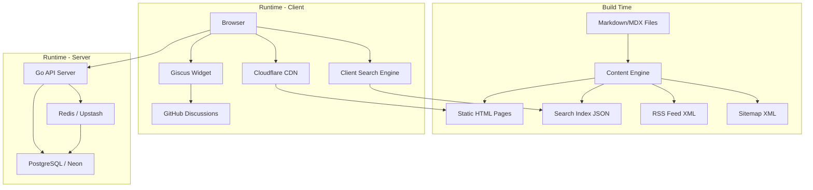
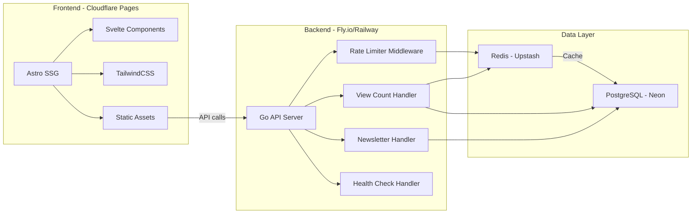

# Tài liệu Thiết kế - Personal Blog

## Tổng quan (Overview)

Hệ thống blog cá nhân được thiết kế theo kiến trúc **JAMstack + API backend**, tách biệt rõ ràng giữa frontend tĩnh (Astro + Svelte) và backend API (Go). Frontend được build thành static HTML và deploy trên CDN (Cloudflare Pages), trong khi backend Go xử lý các tác vụ động như view count, newsletter subscription, và rate limiting.

### Nguyên tắc thiết kế chính

- **Static-first**: Nội dung được render tại build time, giảm thiểu server load
- **Stateless API**: Backend không lưu session state, dễ scale horizontal
- **Cache-heavy**: Redis cache giảm tải cho PostgreSQL, tăng response time
- **Progressive Enhancement**: Trang hoạt động cơ bản không cần JavaScript, JS bổ sung tính năng tương tác
- **Fail-graceful**: Khi service phụ trợ (Redis, DB) gặp sự cố, hệ thống vẫn phục vụ được ở mức cơ bản

### Luồng dữ liệu chính



---

## Kiến trúc (Architecture)

### Kiến trúc tổng thể



### Quyết định kiến trúc

| Quyết định | Lựa chọn | Lý do |
|---|---|---|
| Frontend Framework | Astro + Svelte | Astro cho static generation tốt, Svelte cho interactive islands nhẹ |
| Backend Language | Go (Gin framework) | Performance cao, binary nhỏ, deploy dễ trên container |
| Database | PostgreSQL (Neon) | Reliable, free tier tốt, serverless scaling |
| Cache | Redis (Upstash) | REST-based Redis, free tier, phù hợp serverless |
| Search | Fuse.js (client-side) | Không cần server, search index nhỏ cho blog cá nhân |
| Comments | Giscus | Free, dùng GitHub Discussions, không cần backend riêng |
| CSS | TailwindCSS | Utility-first, tree-shaking tốt, bundle size nhỏ |
| Deployment | Cloudflare Pages + Fly.io | Free tier generous, global CDN, container support |

### Chiến lược Scaling

```
Giai đoạn 1 (0-10K views/tháng):
  - 1 Fly.io instance (free tier)
  - Neon free tier (0.5 GB storage)
  - Upstash free tier (10K commands/ngày)

Giai đoạn 2 (10K-100K views/tháng):
  - 2-3 Fly.io instances (auto-scale)
  - Neon Pro (auto-scaling compute)
  - Upstash Pay-as-you-go

Giai đoạn 3 (100K+ views/tháng):
  - Fly.io auto-scale (5+ instances)
  - Neon với read replicas
  - Upstash Pro hoặc self-hosted Redis
```

---

## Thành phần và Giao diện (Components and Interfaces)

### 1. Content Engine (Build-time)

**Trách nhiệm**: Parse Markdown/MDX, generate HTML, tạo search index, RSS feed, sitemap.

```typescript
// Astro content collection schema
interface BlogPost {
  title: string;
  description: string;
  date: Date;
  updatedDate?: Date;
  category: string;
  tags: string[];
  coverImage?: string;
  draft: boolean;
  slug: string;
}

interface ContentPipeline {
  parseMarkdown(content: string): ParsedContent;
  generateTOC(headings: Heading[]): TOCItem[];
  calculateReadingTime(wordCount: number): number;
  buildSearchIndex(posts: BlogPost[]): SearchIndex;
  generateRSS(posts: BlogPost[]): string;
  generateSitemap(pages: Page[]): string;
}
```

### 2. Frontend Components (Svelte Islands)

```typescript
// Theme Manager
interface ThemeManager {
  getCurrentTheme(): 'light' | 'dark';
  toggleTheme(): void;
  detectSystemPreference(): 'light' | 'dark';
  persistTheme(theme: string): void;
}

// Search Component
interface SearchComponent {
  query: string;
  results: SearchResult[];
  search(query: string): SearchResult[];
  highlight(text: string, query: string): string;
}

// Newsletter Form
interface NewsletterForm {
  email: string;
  status: 'idle' | 'loading' | 'success' | 'error';
  subscribe(email: string): Promise<SubscribeResponse>;
  validateEmail(email: string): boolean;
}
```

### 3. Go API Server

```go
// API Router structure
type Server struct {
    router      *gin.Engine
    db          *pgxpool.Pool
    redis       *redis.Client
    rateLimiter *RateLimiter
}

// Handlers interface
type ViewCountHandler interface {
    IncrementView(c *gin.Context)    // POST /api/views/:slug
    GetViewCount(c *gin.Context)     // GET /api/views/:slug
    GetBulkViewCounts(c *gin.Context) // GET /api/views?slugs=a,b,c
}

type NewsletterHandler interface {
    Subscribe(c *gin.Context)        // POST /api/newsletter/subscribe
    Unsubscribe(c *gin.Context)      // POST /api/newsletter/unsubscribe
    VerifyEmail(c *gin.Context)      // GET /api/newsletter/verify/:token
}

type HealthHandler interface {
    Check(c *gin.Context)            // GET /api/health
}
```

### 4. Rate Limiter

```go
// Rate Limiter interface
type RateLimiter interface {
    // Allow kiểm tra xem request có được phép không
    Allow(ip string, endpoint string) (bool, time.Duration, error)
    // GetCount trả về số request hiện tại trong window
    GetCount(ip string, endpoint string) (int64, error)
}

// Config cho từng endpoint group
type RateLimitConfig struct {
    WindowSize   time.Duration  // Kích thước sliding window
    MaxRequests  int64          // Số request tối đa trong window
    FailOpen     bool           // Cho phép request khi Redis down
}
```

### 5. View Count Service

```go
// View Count với batching strategy
type ViewCountService interface {
    // RecordView ghi nhận lượt xem, trả về false nếu duplicate
    RecordView(ctx context.Context, slug string, ip string) (bool, error)
    // GetCount lấy view count (từ cache hoặc DB)
    GetCount(ctx context.Context, slug string) (int64, error)
    // FlushBatch đẩy batch từ Redis vào PostgreSQL
    FlushBatch(ctx context.Context) error
}
```

### API Endpoints

| Method | Path | Mô tả | Rate Limit |
|--------|------|--------|------------|
| POST | `/api/views/:slug` | Ghi nhận lượt xem | 100 req/min |
| GET | `/api/views/:slug` | Lấy view count | 100 req/min |
| GET | `/api/views` | Lấy bulk view counts | 100 req/min |
| POST | `/api/newsletter/subscribe` | Đăng ký newsletter | 10 req/min |
| POST | `/api/newsletter/unsubscribe` | Hủy đăng ký | 10 req/min |
| GET | `/api/newsletter/verify/:token` | Xác nhận email | 20 req/min |
| GET | `/api/health` | Health check | Không giới hạn |

---

## Mô hình Dữ liệu (Data Models)

### PostgreSQL Schema

```sql
-- Bảng lưu view count cho mỗi bài viết
CREATE TABLE post_views (
    id BIGSERIAL PRIMARY KEY,
    slug VARCHAR(255) NOT NULL UNIQUE,
    view_count BIGINT NOT NULL DEFAULT 0,
    created_at TIMESTAMP WITH TIME ZONE DEFAULT NOW(),
    updated_at TIMESTAMP WITH TIME ZONE DEFAULT NOW()
);

CREATE INDEX idx_post_views_slug ON post_views(slug);
CREATE INDEX idx_post_views_count ON post_views(view_count DESC);

-- Bảng lưu thông tin subscriber
CREATE TABLE newsletter_subscribers (
    id BIGSERIAL PRIMARY KEY,
    email VARCHAR(320) NOT NULL UNIQUE,
    status VARCHAR(20) NOT NULL DEFAULT 'pending', -- pending, active, unsubscribed
    verification_token VARCHAR(64),
    subscribed_at TIMESTAMP WITH TIME ZONE DEFAULT NOW(),
    unsubscribed_at TIMESTAMP WITH TIME ZONE,
    created_at TIMESTAMP WITH TIME ZONE DEFAULT NOW()
);

CREATE INDEX idx_subscribers_email ON newsletter_subscribers(email);
CREATE INDEX idx_subscribers_status ON newsletter_subscribers(status);
CREATE INDEX idx_subscribers_token ON newsletter_subscribers(verification_token);

-- Bảng lưu log view để chống duplicate (optional, có thể dùng Redis thay)
CREATE TABLE view_logs (
    id BIGSERIAL PRIMARY KEY,
    slug VARCHAR(255) NOT NULL,
    ip_hash VARCHAR(64) NOT NULL, -- SHA-256 hash của IP
    viewed_at TIMESTAMP WITH TIME ZONE DEFAULT NOW()
);

CREATE INDEX idx_view_logs_slug_ip ON view_logs(slug, ip_hash);
CREATE INDEX idx_view_logs_viewed_at ON view_logs(viewed_at);

-- Tự động xóa view logs cũ hơn 24h (partition hoặc cron job)
```

### Redis Data Structures

```
# View count cache
view:count:{slug} -> integer (TTL: 5 phút)

# View count batch (chờ flush vào DB)
view:batch:{slug} -> integer (increment, flush mỗi 5 phút)

# Duplicate check (IP đã xem bài viết trong 24h)
view:seen:{slug}:{ip_hash} -> "1" (TTL: 24 giờ)

# Rate limiting (sliding window)
rate:{ip}:{endpoint}:{window_start} -> integer (TTL: window_size * 2)

# API response cache
cache:views:{slug} -> JSON string (TTL: 5 phút)
cache:views:bulk:{hash} -> JSON string (TTL: 5 phút)

# Health check
health:last_check -> timestamp
```

### Frontmatter Schema (Markdown/MDX)

```yaml
---
title: "Tiêu đề bài viết"
description: "Mô tả ngắn cho SEO và preview"
date: 2024-01-15
updatedDate: 2024-01-20  # optional
category: "tech-review"   # exactly one
tags: ["golang", "backend", "api"]  # multiple
coverImage: "./images/cover.jpg"  # optional
draft: false
slug: "tieu-de-bai-viet"  # auto-generated from title if not specified
---
```

### Search Index Schema

```json
{
  "posts": [
    {
      "slug": "tieu-de-bai-viet",
      "title": "Tiêu đề bài viết",
      "description": "Mô tả ngắn",
      "tags": ["golang", "backend"],
      "category": "tech-review",
      "content": "Nội dung text thuần (stripped HTML)...",
      "date": "2024-01-15"
    }
  ]
}
```

---

