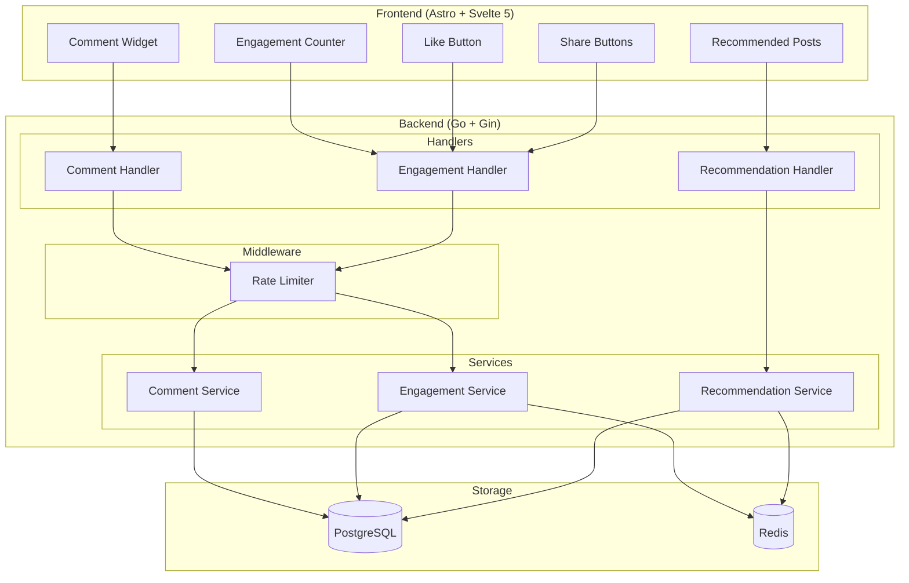
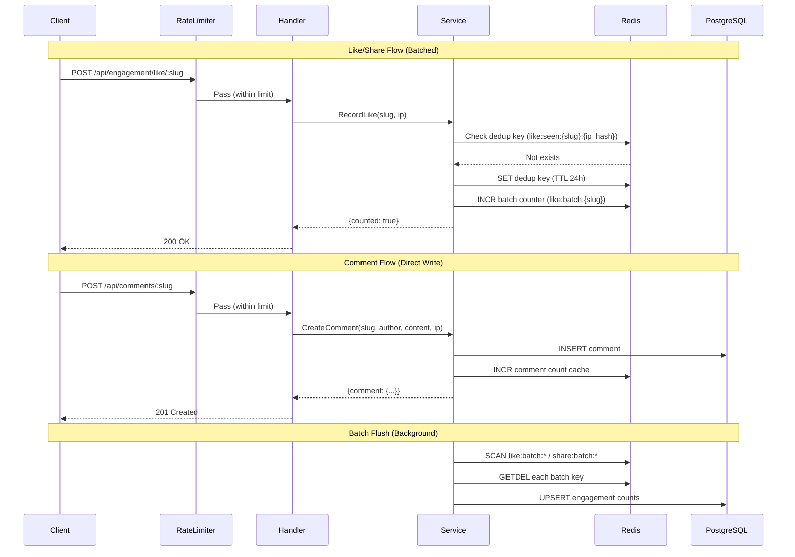

# Design Document: Post Engagement

## Overview

The Post Engagement feature extends the existing blog platform with a comprehensive engagement system including internal comments, likes, share tracking, engagement counters, and a recommendation engine. It replaces the current Utterances-based comment system with a self-hosted solution and adds engagement metrics that drive content recommendations.

The design follows the established architectural patterns in the codebase:
- **Backend**: Go services using Gin framework, pgx for PostgreSQL, go-redis for Redis
- **Frontend**: Svelte 5 components within an Astro static site
- **Data flow**: Redis as write buffer + cache, PostgreSQL as source of truth, periodic batch flush

Key design decisions:
1. **Reuse existing patterns** — The view count service already implements Redis batch + flush + dedup. Likes and shares follow the same pattern.
2. **Internal comment system** — Direct PostgreSQL writes (no Redis buffering for content), replacing Utterances dependency.
3. **Engagement score** — Weighted formula with configurable weights, cached rankings in Redis with 5-minute TTL.
4. **Privacy-first** — IP hashing (SHA-256) for dedup, no user accounts required.

## Architecture



### Request Flow



## Components and Interfaces

### Backend Services

#### EngagementService Interface

```go
// EngagementService handles likes and shares with Redis batching.
type EngagementService interface {
    // RecordLike records a like for a post. Returns true if counted (not duplicate).
    RecordLike(ctx context.Context, slug string, ip string) (bool, error)
    // RecordShare records a share for a post with platform info.
    RecordShare(ctx context.Context, slug string, ip string, platform string) (bool, error)
    // GetCounts returns engagement counts (likes, comments, shares) for a single post.
    GetCounts(ctx context.Context, slug string) (*EngagementCounts, error)
    // GetBulkCounts returns engagement counts for multiple posts.
    GetBulkCounts(ctx context.Context, slugs []string) (map[string]*EngagementCounts, error)
    // FlushBatch flushes pending like/share counts from Redis to PostgreSQL.
    FlushBatch(ctx context.Context) error
}

type EngagementCounts struct {
    Likes    int64 `json:"likes"`
    Comments int64 `json:"comments"`
    Shares   int64 `json:"shares"`
}
```

#### CommentService Interface

```go
// CommentService handles CRUD operations for comments.
type CommentService interface {
    // CreateComment creates a new comment for a post.
    CreateComment(ctx context.Context, input CreateCommentInput) (*Comment, error)
    // GetComments returns all comments for a post in chronological order.
    GetComments(ctx context.Context, slug string) ([]*Comment, error)
    // GetCommentCount returns the comment count for a post.
    GetCommentCount(ctx context.Context, slug string) (int64, error)
}

type CreateCommentInput struct {
    Slug    string
    Author  string
    Content string
    IP      string
}
```

#### RecommendationService Interface

```go
// RecommendationService calculates and caches post rankings.
type RecommendationService interface {
    // GetTopPosts returns the top N posts sorted by engagement score.
    GetTopPosts(ctx context.Context, limit int) ([]*RankedPost, error)
    // RecalculateRankings forces a recalculation of rankings.
    RecalculateRankings(ctx context.Context) error
}

type RankedPost struct {
    Slug            string  `json:"slug"`
    EngagementScore float64 `json:"engagement_score"`
    Likes           int64   `json:"likes"`
    Comments        int64   `json:"comments"`
    Shares          int64   `json:"shares"`
}

type RecommendationConfig struct {
    LikeWeight    float64 // Default: 1.0
    CommentWeight float64 // Default: 2.0
    ShareWeight   float64 // Default: 3.0
    CacheTTL      time.Duration // Default: 5 minutes
    MaxResults    int     // Maximum: 50
}
```

### API Endpoints

| Method | Path | Rate Limit | Description |
|--------|------|-----------|-------------|
| POST | `/api/engagement/like/:slug` | 60/min | Record a like |
| POST | `/api/engagement/share/:slug` | 60/min | Record a share |
| GET | `/api/engagement/:slug` | None | Get engagement counts for a post |
| GET | `/api/engagement` | None | Bulk engagement counts (?slugs=a,b,c) |
| POST | `/api/comments/:slug` | 30/min | Create a comment |
| GET | `/api/comments/:slug` | None | Get comments for a post |
| GET | `/api/recommendations` | None | Get top recommended posts (?limit=10) |

### Frontend Components

#### LikeButton.svelte
- Displays current like count
- Handles click to send like request
- Optimistic UI update on successful like
- Disables button after successful like (localStorage flag)

#### ShareButtons.svelte
- Displays share count and platform buttons (Facebook, Twitter, LinkedIn, Copy Link)
- Fires share tracking request on button click
- Opens platform share dialog

#### EngagementCounter.svelte
- Displays likes, comments, shares counts
- Used in both post detail and post list views
- Graceful degradation when API unavailable (shows 0)

#### CommentSection.svelte (replaces Comments.svelte)
- Comment form with author name and content fields
- Displays existing comments in chronological order
- Client-side validation before submission
- Loading states and error handling

#### RecommendedPosts.svelte
- Fetches and displays top recommended posts
- Used on homepage or sidebar

## Data Models

### PostgreSQL Schema

#### post_engagement table (new)

```sql
CREATE TABLE post_engagement (
    id BIGSERIAL PRIMARY KEY,
    slug VARCHAR(255) NOT NULL UNIQUE,
    like_count BIGINT NOT NULL DEFAULT 0,
    comment_count BIGINT NOT NULL DEFAULT 0,
    share_count BIGINT NOT NULL DEFAULT 0,
    created_at TIMESTAMP WITH TIME ZONE DEFAULT NOW(),
    updated_at TIMESTAMP WITH TIME ZONE DEFAULT NOW()
);

CREATE INDEX idx_post_engagement_slug ON post_engagement(slug);
CREATE INDEX idx_post_engagement_score ON post_engagement(
    (like_count * 1 + comment_count * 2 + share_count * 3) DESC
);
```

#### comments table (new)

```sql
CREATE TABLE comments (
    id BIGSERIAL PRIMARY KEY,
    slug VARCHAR(255) NOT NULL,
    author_name VARCHAR(100) NOT NULL,
    content TEXT NOT NULL,
    ip_hash VARCHAR(64) NOT NULL,
    created_at TIMESTAMP WITH TIME ZONE DEFAULT NOW()
);

CREATE INDEX idx_comments_slug ON comments(slug);
CREATE INDEX idx_comments_slug_created ON comments(slug, created_at ASC);
```

#### share_logs table (new, for platform tracking)

```sql
CREATE TABLE share_logs (
    id BIGSERIAL PRIMARY KEY,
    slug VARCHAR(255) NOT NULL,
    platform VARCHAR(20) NOT NULL,
    ip_hash VARCHAR(64) NOT NULL,
    shared_at TIMESTAMP WITH TIME ZONE DEFAULT NOW()
);

CREATE INDEX idx_share_logs_slug_platform ON share_logs(slug, platform);
```

### Redis Key Schema

| Key Pattern | Type | TTL | Description |
|-------------|------|-----|-------------|
| `like:seen:{slug}:{ip_hash}` | String | 24h | Duplicate like detection |
| `like:batch:{slug}` | String (int) | None | Pending like count for batch flush |
| `share:seen:{slug}:{ip_hash}` | String | 24h | Duplicate share detection |
| `share:batch:{slug}` | String (int) | None | Pending share count for batch flush |
| `engagement:count:{slug}` | Hash | 5min | Cached engagement counts (likes, comments, shares) |
| `comment:count:{slug}` | String (int) | 5min | Cached comment count |
| `recommendations:top` | Sorted Set | 5min | Cached ranked posts (score = engagement_score) |

